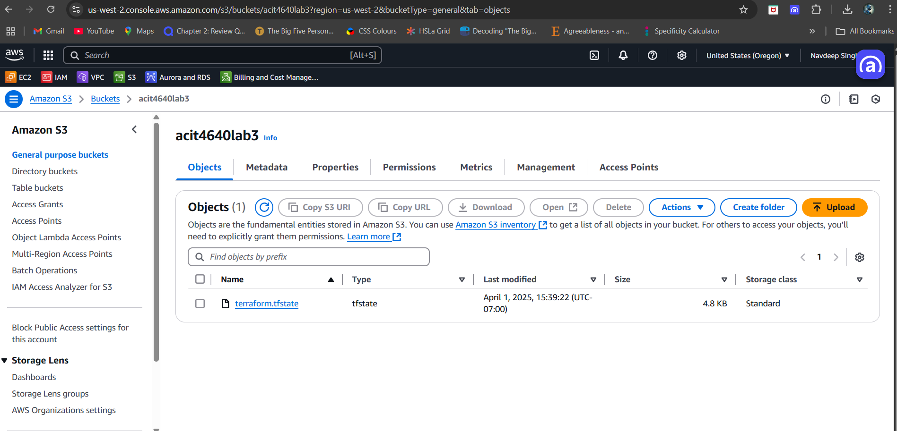
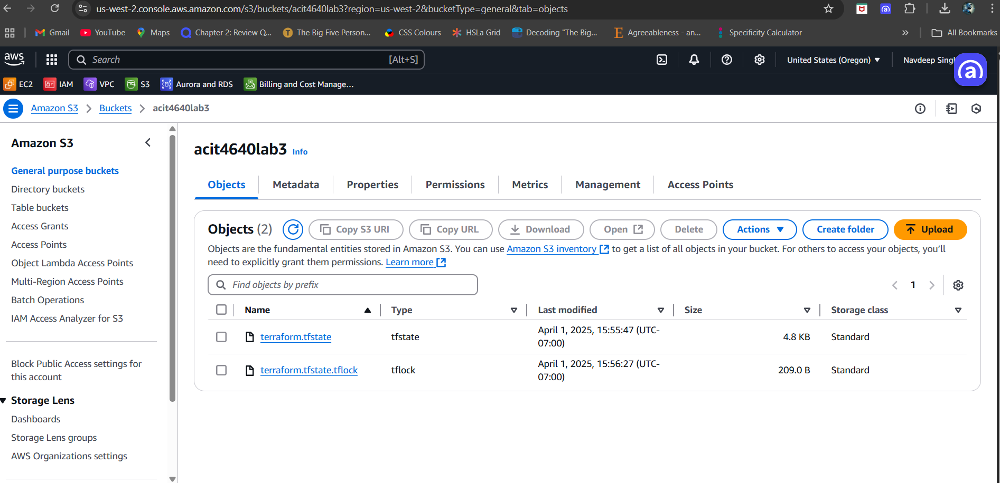
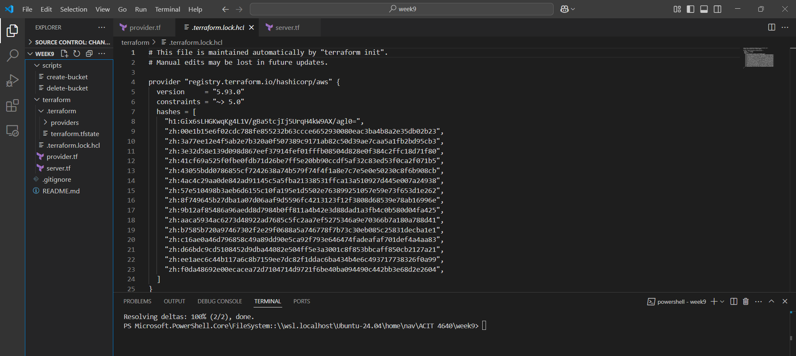
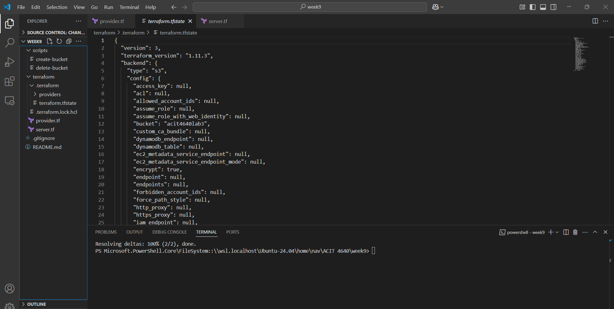

## Remote Backend Questions

### When is the state file created?
The state file (`terraform.tfstate`) is created after you run `terraform apply` for the first time. It is stored in the S3 bucket specified in the backend configuration.

### When is the lock file present?
The lock file is present only during active Terraform operations such as `terraform plan`, `terraform apply`, or `terraform destroy`. It is used to prevent concurrent changes to the infrastructure state.

### Is the lock file always in the bucket after it is created?
No, the lock file is temporary. It is automatically removed after the operation that created it is completed. It will not persist in the S3 bucket.

## Screenshots
### State File in S3 Bucket

### Lock File and State File During Terraform Apply

### State File in S3 Bucket

### Lock File and State File During Terraform Apply

